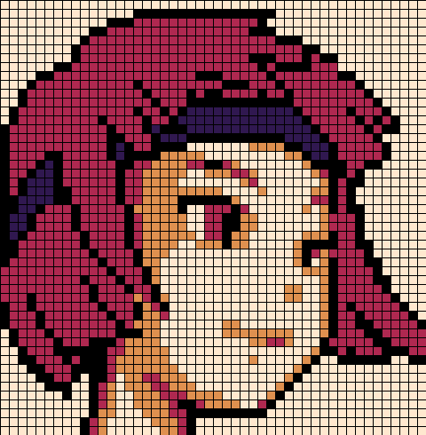
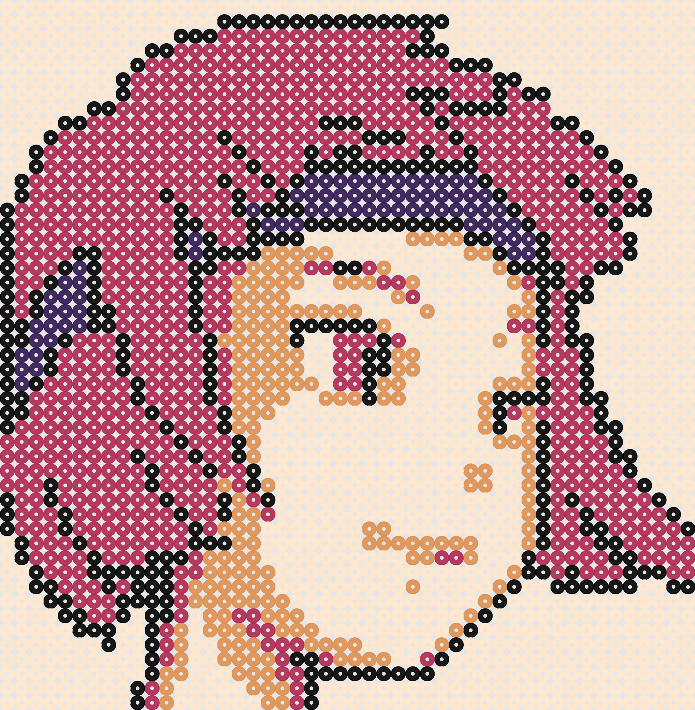

# PixArt Beads

This repo contains some python scripts that should be useful in transforming images into pixel-beads images and handcrafts!



Some of the features are:

* Color quantization: with the option to use number of colors, provided or user-defined color palettes.
* Image downscale: 
* Image upscale:
* Color replace:
* Color mapping: 
* Color palette:
* Color counts:

## Instructions

To use the scripts first install the required dependencies either through the REQUIREMENTS files (txt/yml), or manually:

```bash
pip install numpy
pip install Pillow
pip install matplotlib
pip install opencv-python
```

And, ideally, give the bash script executable permissions:

```bash
chmod +x beadify.sh
```


Then have a look at the following parameters:

* Folder (fld): Working directory for input and output images
* Name (nme): Original image's name
* Downscale: (w, h) tuple of the number of pixels of our beads pattern
* Upscale: Multiplier scaler to upscale our pixelated image for easy reading
* Colors Number (colorsNumber): Number of colors to be used in the quantization process (overridden if the color palette is provided)
* Color Palette (colorPalette): List of HEX values to be used in the quantization of the image. Set color palette to "None" to use the colorsNumber parameter instead.
* Method (int): [0: median cut, 1: maximum coverage, 2: fast octree]

## Available Palettes

Some nice [color palettes](./palettes/README.md) are included in the scripts, but if you have the hex colors of your beads, please follow [this link](./palettes/README.md) for information on how to use them in your handcraft! A subset of the included palettes is shown but follow the [link](./palettes/README.md) for the full list:

<table>
    <tr><th>Code</th><th>Palette</th><th>Source</th></tr>
    <!--Table Begins-->
    <tr><td>Blessing_5</td><td></td><td><a href=https://lospec.com/palette-list/blessing>https://lospec.com/palette-list/blessing</a></td></tr>
    <tr><td>CoolWood_8</td><td></td><td><a href=https://lospec.com/palette-list/coldwood8>https://lospec.com/palette-list/coldwood8</a></td></tr>
    <tr><td>Gray2Bit_4</td><td></td><td><a href=https://lospec.com/palette-list/2-bit-grayscale>https://lospec.com/palette-list/2-bit-grayscale</a></td></tr>
    <tr><td>IslandJoy_16</td><td></td><td><a href=https://lospec.com/palette-list/island-joy-16>https://lospec.com/palette-list/island-joy-16</a></td></tr>
    <tr><td>MF_16</td><td></td><td><a href=https://lospec.com/palette-list/mf-16>https://lospec.com/palette-list/mf-16</a></td></tr>
    <tr><td>Mist_GB</td><td></td><td><a href=https://lospec.com/palette-list/mist-gb>https://lospec.com/palette-list/mist-gb</a></td></tr>
    <tr><td>NES</td><td></td><td><a href=https://lospec.com/palette-list/nintendo-entertainment-system>https://lospec.com/palette-list/nintendo-entertainment-system</a></td></tr>
    <tr><td>Nostalgia_36</td><td></td><td><a href=https://lospec.com/palette-list/nostalgia36>https://lospec.com/palette-list/nostalgia36</a></td></tr>
    <tr><td>OneBitGlow_2</td><td></td><td><a href=https://lospec.com/palette-list/1bit-monitor-glow>https://lospec.com/palette-list/1bit-monitor-glow</a></td></tr>
    <tr><td>Super_16</td><td></td><td><a href=https://lospec.com/palette-list/super16>https://lospec.com/palette-list/super16</a></td></tr>
    <tr><td>Sweetie_16</td><td></td><td><a href=https://lospec.com/palette-list/sweetie-16>https://lospec.com/palette-list/sweetie-16</a></td></tr>
</table> 

##  Author

<br>

[Héctor M. Sánchez C.](https://chipdelmal.github.io/)
