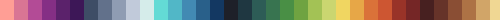

# PixArt Beads

This repo contains some python scripts that should be useful in transforming images into pixel-beads images and handcrafts!


Some of the features are:

* Color quantization: with the option to use number of colors, provided or user-defined color palettes.
* Image downscale: 
* Image upscale:
* Color replace:
* Color mapping: 
* Color palette:
* Color counts:

## Instructions

To use the scripts first install the required dependencies either through the REQUIREMENTS files (txt/yml), or manually:

```bash
pip install numpy
pip install Pillow
pip install matplotlib
pip install opencv-python
```

And, ideally, give the bash script executable permissions:

```bash
chmod +x beadify.sh
```


Then have a look at the following parameters:

* Folder (fld): Working directory for input and output images
* Name (nme): Original image's name
* Downscale: (w, h) tuple of the number of pixels of our beads pattern
* Upscale: Multiplier scaler to upscale our pixelated image for easy reading
* Colors Number (colorsNumber): Number of colors to be used in the quantization process (overridden if the color palette is provided)
* Color Palette (colorPalette): List of HEX values to be used in the quantization of the image. Set color palette to "None" to use the colorsNumber parameter instead.
* Method (int): [0: median cut, 1: maximum coverage, 2: fast octree]

## Available Palettes

Some nice color palettes are included in the scripts, but if you have the hex colors of your beads, please follow [this link](./palettes/README.md) for information on how to use them in your handcraft!

<table>
    <tr><th>Code</th><th>Palette</th><th>Source</th></tr>
    <!--Table Begins-->
    <tr><td>Ammo_8</td><td></td><td><a href=https://lospec.com/palette-list/ammo-8>https://lospec.com/palette-list/ammo-8</a></td></tr>
    <tr><td>Blessing_5</td><td></td><td><a href=https://lospec.com/palette-list/blessing>https://lospec.com/palette-list/blessing</a></td></tr>
    <tr><td>BlkNeo_46</td><td></td><td><a href=https://lospec.com/palette-list/blk-neo>https://lospec.com/palette-list/blk-neo</a></td></tr>
    <tr><td>Comfort44S_44</td><td></td><td><a href=https://lospec.com/palette-list/comfort44s>https://lospec.com/palette-list/comfort44s</a></td></tr>
    <tr><td>CoolWood_8</td><td></td><td><a href=https://lospec.com/palette-list/coldwood8>https://lospec.com/palette-list/coldwood8</a></td></tr>
    <tr><td>Endesaga_32</td><td></td><td><a href=https://lospec.com/palette-list/endesga-32>https://lospec.com/palette-list/endesga-32</a></td></tr>
    <tr><td>Famicube_64</td><td></td><td><a href=https://lospec.com/palette-list/famicube>https://lospec.com/palette-list/famicube</a></td></tr>
    <tr><td>GB_5</td><td></td><td><a href=https://www.designpieces.com/palette/game-boy-original-color-palette-hex-and-rgb/>https://www.designpieces.com/palette/game-boy-original-color-palette-hex-and-rgb/</a></td></tr>
    <tr><td>Gray2Bit_4</td><td></td><td><a href=https://lospec.com/palette-list/2-bit-grayscale>https://lospec.com/palette-list/2-bit-grayscale</a></td></tr>
    <tr><td>2Bit_Grayscale</td><td></td><td><a href=https://lospec.com/palette-list/2-bit-grayscale>https://lospec.com/palette-list/2-bit-grayscale</a></td></tr>
    <tr><td>IslandJoy_16</td><td></td><td><a href=https://lospec.com/palette-list/island-joy-16>https://lospec.com/palette-list/island-joy-16</a></td></tr>
    <tr><td>LeMasteros_89</td><td></td><td><a href=https://lospec.com/palette-list/le-masteros-paletas>https://lospec.com/palette-list/le-masteros-paletas</a></td></tr>
    <tr><td>Lux2k_36</td><td></td><td><a href=https://lospec.com/palette-list/lux2k>https://lospec.com/palette-list/lux2k</a></td></tr>
    <tr><td>MF_16</td><td></td><td><a href=https://lospec.com/palette-list/mf-16>https://lospec.com/palette-list/mf-16</a></td></tr>
    <tr><td>Mist_GB</td><td></td><td><a href=https://lospec.com/palette-list/mist-gb>https://lospec.com/palette-list/mist-gb</a></td></tr>
    <tr><td>NES</td><td></td><td><a href=https://lospec.com/palette-list/nintendo-entertainment-system>https://lospec.com/palette-list/nintendo-entertainment-system</a></td></tr>
    <tr><td>Nostalgia_36</td><td></td><td><a href=https://lospec.com/palette-list/nostalgia36>https://lospec.com/palette-list/nostalgia36</a></td></tr>
    <tr><td>OneBitGlow_2</td><td></td><td><a href=https://lospec.com/palette-list/1bit-monitor-glow>https://lospec.com/palette-list/1bit-monitor-glow</a></td></tr>
    <tr><td>Pear_36</td><td></td><td><a href=https://lospec.com/palette-list/pear36>https://lospec.com/palette-list/pear36</a></td></tr>
    <tr><td>Pilxten_41</td><td></td><td><a href=https://lospec.com/palette-list/pixlten>https://lospec.com/palette-list/pixlten</a></td></tr>
    <tr><td>Resurrect_32</td><td></td><td><a href=https://lospec.com/palette-list/resurrect-32>https://lospec.com/palette-list/resurrect-32</a></td></tr>
    <tr><td>SGBM1A_4</td><td></td><td><a href=https://lospec.com/palette-list/super-game-boy-menu-1-palette-a>https://lospec.com/palette-list/super-game-boy-menu-1-palette-a</a></td></tr>
    <tr><td>SGB1B_4</td><td></td><td><a href=https://lospec.com/palette-list/super-game-boy-menu-1-palette-b>https://lospec.com/palette-list/super-game-boy-menu-1-palette-b</a></td></tr>
    <tr><td>SGBM1C_4</td><td></td><td><a href=https://lospec.com/palette-list/super-game-boy-menu-1-palette-c>https://lospec.com/palette-list/super-game-boy-menu-1-palette-c</a></td></tr>
    <tr><td>SGMB1D_4</td><td></td><td><a href=https://lospec.com/palette-list/super-game-boy-menu-1-palette-d>https://lospec.com/palette-list/super-game-boy-menu-1-palette-d</a></td></tr>
    <tr><td>SLSO_8</td><td></td><td><a href=https://lospec.com/palette-list/slso8>https://lospec.com/palette-list/slso8</a></td></tr>
    <tr><td>Super_16</td><td></td><td><a href=https://lospec.com/palette-list/super16>https://lospec.com/palette-list/super16</a></td></tr>
    <tr><td>Sweetie_16</td><td></td><td><a href=https://lospec.com/palette-list/sweetie-16>https://lospec.com/palette-list/sweetie-16</a></td></tr>
    <tr><td>Twilight_5</td><td></td><td><a href=https://lospec.com/palette-list/twilight-5>https://lospec.com/palette-list/twilight-5</a></td></tr>
    <tr><td>Zant_30</td><td></td><td><a href=https://lospec.com/palette-list/zant>https://lospec.com/palette-list/zant</a></td></tr>
</table> 

**Important Note**: Please note that the included color palettes are not mine. They were obtained from https://lospec.com/palette-list/, so please visit the palette sources and support the authors' work if possible!

<hr>

##  Author

<br>

[Héctor M. Sánchez C.](https://chipdelmal.github.io/)
