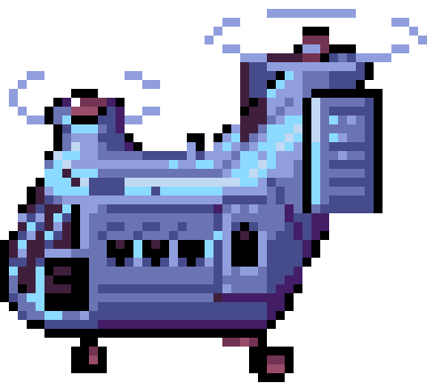
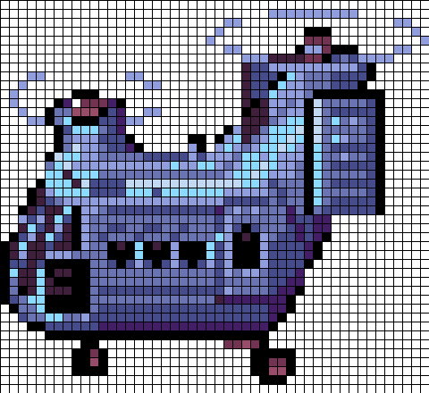
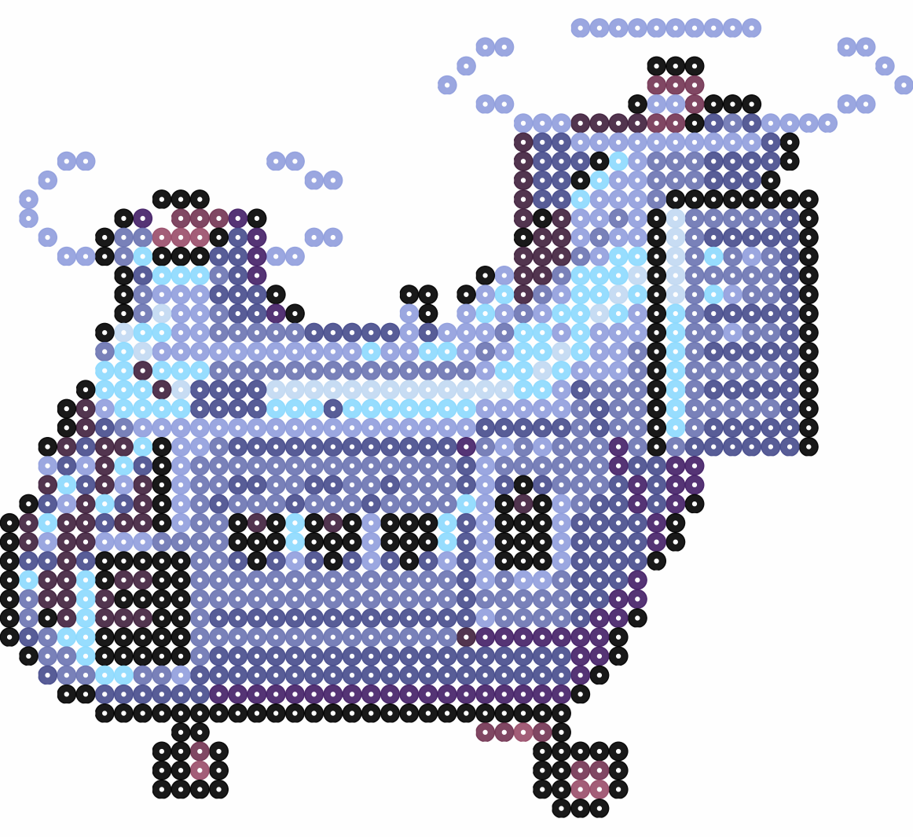
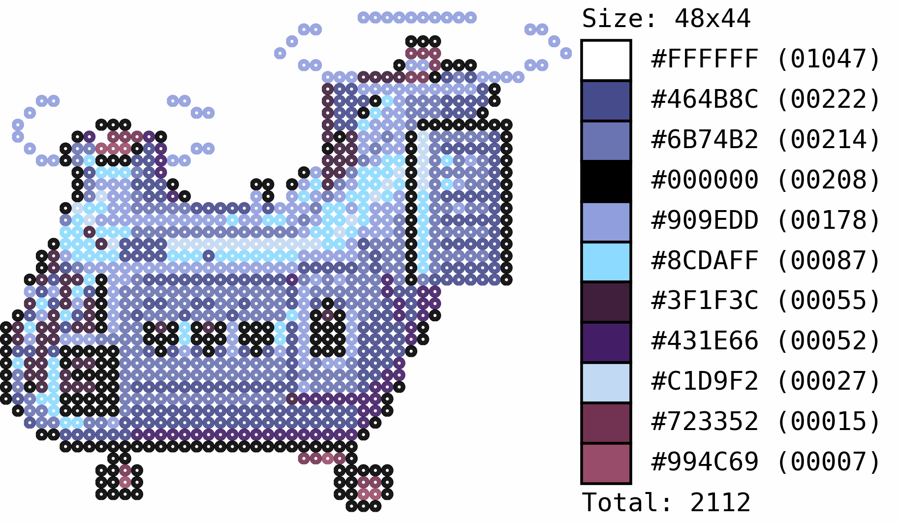

# PixArt Beads: Demo

## Processing a single image

For this demo we're gonna process a sprite from [Advance Wars](https://www.spriters-resource.com/game_boy_advance/advancewars2blackholerising/) (a great site for getting some nice sprites is: [the spriters resource](https://www.spriters-resource.com/).


In this example, we will change the image's background to white, downscale it, and process with the [Blk Neo](https://lospec.com/palette-list/blk-neo) color palette.

### 1. Setting working directory up

For simplicity, are going to assume the folder is in our `$HOME` directory and is named `tCopter`. First, we place our image `TransportCopter.png` in the folder along with the `BlkNeo_46.plt` color palette file (available [here](https://github.com/Chipdelmal/PixelatorBeads/blob/main/palettes/BlkNeo_46.plt)) and an empty txt file named `CMapper.map` (for the color mapping/background removal).

### 2. Color-mapping

We want to remove the pink background from the image, so we are going to map that color to white. To do this, just open the `CMapper.map` file in a text editor and add the following line: `#ff7fff, #ffffff`; this will tell our application to change every `#ff7fff` pixel into `#ffffff`. An arbitrary list of color mappings can be added if a more complicated mapping is desired (the colors will be mapped sequentially in the order provided by the file).

### 3. Processing the image

The only thing needed now is to run our script. The first way to do it is by calling our `bash` script as described in our main [README](../README.md):

```bash
./main.sh $PTH $IMG $DWN $UPS $DBG
```

The original image is 63x58 pixels, so let's try and rescale it a bit so that the total width is 48px (the height will be auto-calculated so that it maintains the same aspect ratio). Additionally, let's "upscale" the output images by a factor of 10 so that we end up with images 480x440px in size. Finally, let's set the debug mode on to keep all the intermediate images:

```bash
./main.sh ./demo/tCopter TransportCopter.png 48 10 1
```

This will process the image with all of the `.pal` files available in the work directory. One way to run a specific color palette would be by calling the original python routine:

```bash
python main.py ./demo/tCopter TransportCopter.png BlkNeo_46.plt 48 10 1
```

Which would give us the same results in this case.

### 4. Outputs

This script will generate the following images in a `TransportCopter` folder (in order):

* **DWN**: Downscaled (resized)
* **UPS**: Upscaled
* **GRD**: Gridded
* **BDS**: Beads
* **FNL**: Beads with swatch and color counts





## Processing a batch of images